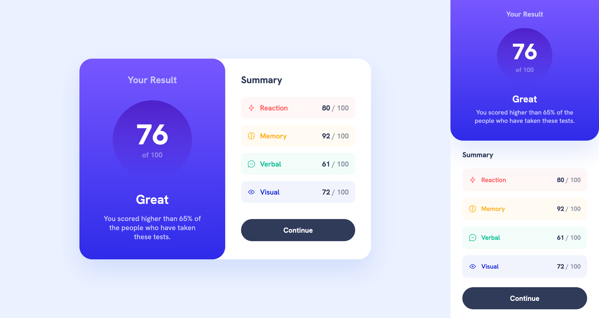

# Frontend Mentor - Results summary component solution

This is a solution to the [Results summary component challenge on Frontend Mentor](https://www.frontendmentor.io/challenges/results-summary-component-CE_K6s0maV).

## Table of contents

- [Overview](#overview)
  - [The challenge](#the-challenge)
  - [Screenshot](#screenshot)
  - [Links](#links)
- [My process](#my-process)
  - [Built with](#built-with)
  - [What I learned](#what-i-learned)
  - [Continued development](#continued-development)
  - [Useful resources](#useful-resources)
- [Author](#author)

## Overview

### The challenge

Users should be able to:

- View the optimal layout for the interface depending on their device's screen size
- See hover and focus states for all interactive elements on the page

### Screenshot

### Links

- Solution URL: [Frontend Mentor: Results summary component using Flexbox](https://www.frontendmentor.io/solutions/results-summary-component-using-flexbox-vasety17c7)
- Live Site URL: [GitHub Pages](https://danielalyoshin.github.io/frontend-mentor-results-summary-component/)

## My process

### Built with

- HTML
- CSS

### What I learned

For this component, I had to work through several obstacles to tackle responsiveness. Having managed to get the component to look good on various screen sizes has helped to grow my understanding of Flexbox and media queries.

### Continued development

In the future, I intend to complete more of these mini-projects, including those using JavaScript, after which I will move on to learning frameworks such as React, Svelte, and Tailwind CSS.

### Useful resources

- ["A Modern CSS Reset"](https://andy-bell.co.uk/a-modern-css-reset/) - For a set of more "preferable" defaults.

## Author

- Website - [alyoshin.dev](https://alyoshin.dev)
- GitHub - [danielalyoshin](https://github.com/danielalyoshin)
- Frontend Mentor - [@danielalyoshin](https://www.frontendmentor.io/profile/danielalyoshin)
- Twitter - [@danielalyoshin](https://www.twitter.com/danielalyoshin)
- LinkedIn - [in/danielalyoshin](https://www.linkedin.com/in/danielalyoshin/)